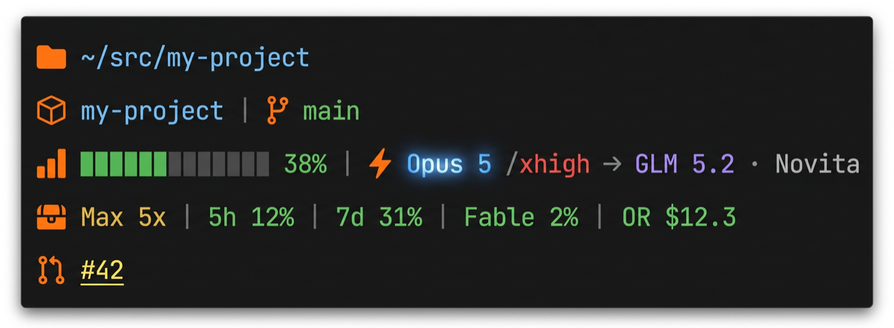

# claude-statusline

Claude Code の多段ステータスライン。カレントディレクトリ・Git・コンテキスト使用量・モデル・プラン枠に加え、**LLM ゲートウェイが OpenRouter へ外注した際の経路と残額**を表示します。

Node の単一スクリプトで、依存パッケージはありません。描画時にネットワークへは触れません。



> 上の画像は実画面のキャプチャではなく、**架空の値で作成したイメージ図**です。
> アイコンは既定の Nerd Font モードの見た目で、種類を問わず**すべて同じオレンジ `#FF6A00`** に統一しています。
> `STATUSLINE_ICONS=emoji` を指定すると、この位置が絵文字に置き換わります。

## 表示される内容

| 行 | 内容 | 出ない条件 |
| --- | --- | --- |
| 1 | カレントディレクトリ（ホームは `~` に短縮） | 常に出る |
| 2 | リポジトリ名 │ ブランチ | Git 管理外なら**行ごと消える**。主ツリーが既定ブランチ(main)以外、または worktree が既定ブランチを保持していると**赤＋警告記号**で理由を添える |
| 3 | コンテキスト使用量バー │ モデル/effort **[→ 外注先モデル · 配信事業者]** | 矢印以降は直近に外注が無ければ出ない |
| 4 | プラン種別 │ 5h 枠 │ 7d 枠 │ モデル別週間枠 │ **各サービスの残額**（OpenRouter / RunPod / Anlas） | 各要素は取得できたものだけ出る |
| 5 | PR 番号 | PR に紐づいていなければ出ない |

行数は固定ではありません。Git 管理外のディレクトリでは 2 行目が消えて全体が 1 行短くなります。

**4 行目のうち、プラン種別とモデル別週間枠だけは背景取得**です（stdin に載らないため）。取得が止まると
前回の値がそのまま出続けてしまうので、**古くなった時点で値を薄く落とし、経過時間を赤で添えます**。

```
󰜦 Max 20x │ 5h 40% │ 7d 30% │ Fable 22% │ OR $12.3              # 正常
󰜦 Max 5x  │ 5h 40% │ 7d 30% │ Fable 12% │  30時間前 (token 期限切れ・claude -p で復帰) │ OR $12.3   # 取得が止まっている
```

プラン種別（Max 5x ⇄ 20x）は既定 1 時間ごとに取り直すので、**プランを切り替えれば自動で追従します**。

**色の意味**

| 対象 | 配色 |
| --- | --- |
| コンテキスト使用量・各種枠 | 0-30% 緑 → 31-60% 黄 → 61-90% 赤 → 91%+ 紫 |
| effort | low 白 / medium 青 / high 緑 / xhigh 赤 / max 金 |
| モデル名 | 主要モデルごとに中央がふわっと光る静的グラデーション |
| **外注先モデル名** | **藤色 `#A78BFA`**。自前のモデルとは別系統の色にして「外部へ出ている」ことが一目で分かる |
| OpenRouter / RunPod 残額 | 残額の絶対値で判定（$15 超=緑 / $15 以下=黄 / $10 以下=赤 / $5 以下=紫） |
| Anlas 残高 | 別のしきい値（2000 以上=緑 / 2000 未満=黄 / 1000 未満=赤 / 500 未満=紫） |
| **古くなった値** | **薄く（dim）落とす。金や sheen のまま出すと「今の値」に見えて凍結に気づけない** |

## 必要環境

- Node.js 18 以降（グローバルの `fetch` と `AbortSignal.timeout` を使用）
- macOS（プラン種別・週間枠の取得に Keychain を読むため。**この機能を使わなければ他 OS でも 1〜3 行目と PR 行は動作します**）
- Nerd Font（アイコン表示用。無い場合は `STATUSLINE_ICONS=emoji` で絵文字にフォールバック）

## インストール

### 1. 取得する

```sh
git clone https://github.com/keigoly/claude-statusline.git ~/src/claude-statusline
```

### 2. Claude Code から見える場所に置く

symlink を推奨します。clone 先で編集すれば、次の描画からそのまま反映されます。

```sh
ln -s ~/src/claude-statusline/statusline.cjs ~/.claude/statusline.cjs
```

`usage-fetch.cjs` は**移動もコピーも不要**です。`statusline.cjs` の実体があるディレクトリから自動で解決されます（`realpathSync(__filename)` の dirname を見るため、symlink 越しでも clone 先が参照されます）。

> symlink を使わずコピーする場合は、**`statusline.cjs` と `usage-fetch.cjs` の 2 つを同じディレクトリへ**置いてください。

### 3. `~/.claude/settings.json` に登録する

```json
{
  "statusLine": {
    "type": "command",
    "command": "/usr/bin/env node /Users/you/.claude/statusline.cjs",
    "padding": 0
  }
}
```

`refreshInterval` は不要です（配色が静的なため）。

### 4. 動作を確認する

Claude Code を再起動しなくても、次の描画から反映されます。手元で先に見たい場合は、モックの JSON を流し込みます。

```sh
cd ~/src/claude-statusline
echo '{"model":{"display_name":"Opus 5"},"effort":{"level":"xhigh"},"workspace":{"current_dir":"/tmp/demo","repo":{"name":"demo"}},"context_window":{"used_percentage":38},"rate_limits":{"five_hour":{"used_percentage":12,"resets_at":0}},"pr":{"number":42}}' | node statusline.cjs
```

アイコンが豆腐（□）になる場合は Nerd Font が入っていません。端末のフォント設定を見直すか、`STATUSLINE_ICONS=emoji` で絵文字に切り替えてください。

### 5.（任意）OpenRouter 連携を有効にする

素の状態では 4 行目の残額と 3 行目の矢印は出ません。使う場合は `settings.json` の `env` に足します。

```json
{
  "env": {
    "STATUSLINE_EVENTS_DIR": "/path/to/your/gateway/events",
    "STATUSLINE_ENV_FILE": "/path/to/your/.env"
  }
}
```

`OPENROUTER_API_KEY` を `settings.json` へ直接書かずに済むよう、キーは `STATUSLINE_ENV_FILE` が指すファイル側に置く設計です。環境変数で直接渡しても構いません。

反映されたかは背景フェッチャを手で 1 回動かすと確認できます。

```sh
STATUSLINE_ENV_FILE=/path/to/your/.env node usage-fetch.cjs
cat ~/.claude/statusline-usage-cache.json
```

## 設定

すべて環境変数です。`settings.json` の `env` に書けます。**未設定でも動作し、該当機能が出ないだけです**（fail-open）。

| 変数 | 既定 | 用途 |
| --- | --- | --- |
| `STATUSLINE_ICONS` | `nerd` | `emoji` で絵文字アイコンに切替 |
| `STATUSLINE_EVENTS_DIR` | 未設定 | **外注経路の表示に必須**。ゲートウェイのイベント JSONL があるディレクトリ |
| `STATUSLINE_ROUTE_WINDOW_SEC` | `900` | 外注経路（完了済み）を表示する時間窓（秒） |
| `STATUSLINE_ROUTE_INFLIGHT_WINDOW_SEC` | `180` | 生成中（`in_flight`）を表示する時間窓（秒）。完了行が書かれずに落ちた場合の貼り付き防止 |
| `STATUSLINE_ROUTE_IGNORE_PROVIDERS` | `FakeProv` | 無視する配信事業者名（カンマ区切り）。テスト用の偽サーバを除外する |
| `STATUSLINE_ENV_FILE` | 未設定 | `OPENROUTER_API_KEY` を読む dotenv 形式ファイルのパス |
| `OPENROUTER_API_KEY` | 未設定 | **残額表示に必須**。直接指定するか `STATUSLINE_ENV_FILE` 経由 |
| `STATUSLINE_USAGE_TTL_SEC` | `300` | 背景フェッチャを再実行する間隔（秒） |
| `STATUSLINE_PROFILE_TTL_SEC` | `3600` | プラン種別（Max 5x / 20x）を取り直す間隔（秒） |
| `STATUSLINE_STALE_SEC` | `1800` | この秒数だけ背景取得が成功していなければ「古い」として薄く落とす |
| `STATUSLINE_CLAUDE_BIN` | 自動検出 | トークン期限切れ時に起動する `claude` のパス。空文字で起動そのものを無効化 |
| `STATUSLINE_REFRESH_INTERVAL_SEC` | `1800` | `claude -p` を再起動するまでの最短間隔（秒） |
| `RUNPOD_API_KEY` | 未設定 | RunPod 残額の表示に必要。`STATUSLINE_ENV_FILE` 経由でも可 |
| `NOVELAI_API_KEY` | 未設定 | Anlas 残高の表示に必要。`STATUSLINE_ENV_FILE` 経由でも可 |

## OpenRouter 連携

2 つの機能があり、取得経路はまったく別です。

### 外注経路（3 行目の `→ GLM 5.2 · Novita`）

`STATUSLINE_EVENTS_DIR` 配下の `events_YYYY-MM-DD.jsonl`（JST 日付）を読みます。1 行 1 レコードの JSONL で、次の形を期待します。余分なキーは無視されます。

```json
{"timestamp":"2026-08-09T01:38:51+00:00",
 "payload":{"backend":"openrouter","model":"z-ai/glm-5.2","provider":"Novita"}}
```

ファイル**末尾 64KB だけ**を読んで後方から走査し、時間窓以内で最初に見つかった 1 件を表示します。実測 0.110ms/回で、ネットワークもプロセス起動もしません。ディレクトリが無くても無害です。

`payload.in_flight` が `true` の行は「呼び出し開始・完了前」を表し、配信事業者名の代わりに `⋯` を出します。

```
 Opus 5 → Gemini 3 Pro Image ⋯                    # 生成中
 Opus 5 → Gemini 3 Pro Image · Google AI Studio   # 完了
```

行は追記順＝時系列なので、完了行は開始行より後ろにあり自然に勝ちます。完了行が書かれないまま落ちた場合に「生成中」が居座らないよう、`in_flight` の行だけは `STATUSLINE_ROUTE_INFLIGHT_WINDOW_SEC`（既定 180 秒）という短い窓で切ります。画像生成は 1 枚 20〜60 秒なので正常系はこれで覆えます。

`model` は `z-ai/glm-5.2` → `GLM 5.2`、`deepseek/deepseek-v4-pro` → `DeepSeek V4 Pro` のように整形されます。未知の slug も機械的に整形されるため、外注先が増えても壊れません。

> **注意**: ゲートウェイの回帰テストが本番と同じログへ書き込む構成だと、テスト実行のたびに偽の経路が表示されます。`STATUSLINE_ROUTE_IGNORE_PROVIDERS` に偽サーバ名を並べてください。

### 残額（4 行目の `OR $12.3`）

背景フェッチャが `GET /api/v1/key` と `/api/v1/credits` を叩き、キャッシュへ書きます。statusline 本体はキャッシュを読むだけです。

上限が 2 系統あり、**先に枯れる方**が実際の制約になるため `min` を採ります。

| 系統 | 出典 |
| --- | --- |
| クレジット残高 = `total_credits - total_usage` | `/credits` |
| キーの期間上限残 = `limit_remaining` | `/key` |

着色は**残額の絶対値**で決めます（$15 超=緑 / $15 以下=黄 / $10 以下=赤 / $5 以下=紫）。上限に対する割合ではなく「あと何ドル使えるか」で危険度が決まるためです。クレジットを買い足せば自動的に上限側へ切り替わります。同じキーを複数環境で使い回している場合、この値は**それらの合算**になります。

## 制約

- **モデル別週間枠とプラン種別は stdin に載りません。** Claude Code が渡す `rate_limits` は `five_hour` / `seven_day` のみです。これらは背景フェッチャが Claude Code 自身の使う**非公開エンドポイント**（`/api/oauth/usage` と `/api/oauth/profile`）から補完しています。**公式にサポートされた経路ではなく、本体の更新で壊れる可能性があります。** 壊れても fail-open で、他の表示は出続けます（値は薄く落ち、経過時間が付きます）。
- **OAuth トークンのリフレッシュは自前ではしません。** Keychain のトークンが期限切れの間は背景取得を丸ごと見送ります（1 回も叩きません）。Claude Code の対話セッションは更新したトークンを Keychain に書き戻さないため、期限切れを見つけたら `claude -p 'ok' --model haiku` を 1 回だけ起動して本体に書き戻させます（最短 30 分間隔・haiku への極小の 1 往復。`STATUSLINE_CLAUDE_BIN=''` で無効化）。refresh token まで切れている場合は「要再ログイン」と表示します。
- **再描画はアイドル約 1fps・アクティブ約 3fps が上限**です（`refreshInterval` は整数秒のみ）。滑らかなアニメーションは構造的に実現できないため、配色は静的グラデーションを採用しています。
- **truecolor 非対応の端末では色が近似表示**になります。

## ライセンス

MIT License. 詳細は [LICENSE](./LICENSE) を参照してください。
